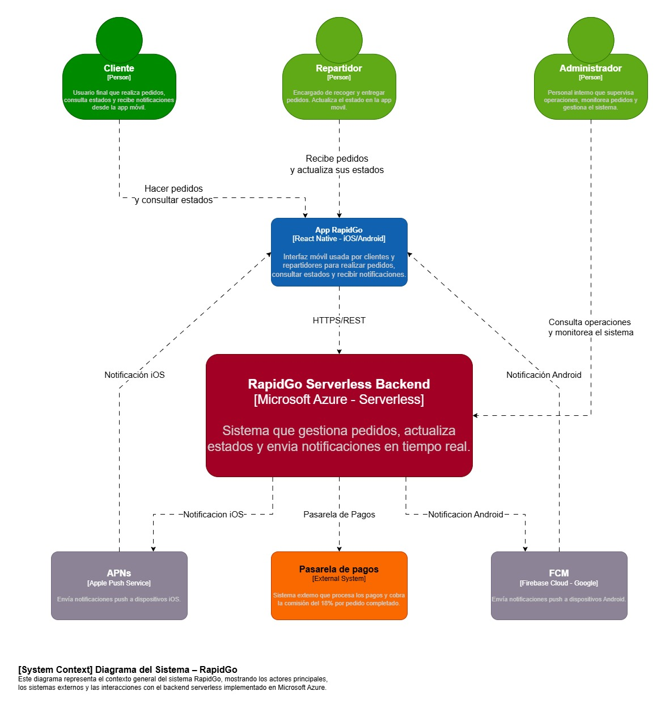
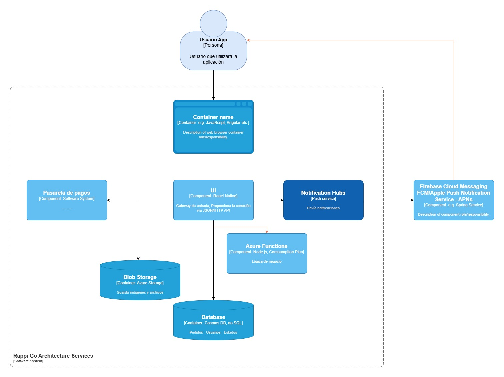
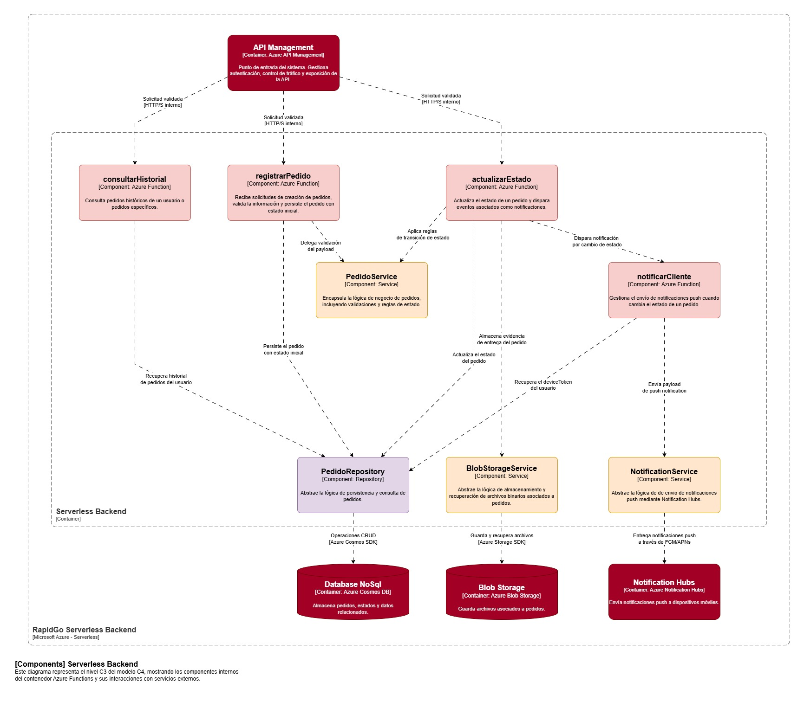

# RapidGo — Serverless Backend Architecture on Azure

Arquitectura cloud nativa para una plataforma de delivery de alta demanda, diseñada para escalar automáticamente, optimizar costos y garantizar disponibilidad en tiempo real.

---

## Visión General

RapidGo es una plataforma de domicilios que conecta clientes, comercios y repartidores a través de una aplicación móvil.
El crecimiento acelerado del negocio ha evidenciado limitaciones en su backend monolítico actual, particularmente en:

* Escalabilidad durante picos de demanda
* Costos operativos elevados por infraestructura dedicada
* Despliegues con interrupciones
* Baja confiabilidad en notificaciones

Este proyecto propone una **arquitectura serverless en Microsoft Azure**, orientada a resolver estos problemas mediante un enfoque desacoplado, escalable y basado en eventos.

---

## Objetivos Arquitectónicos

* Escalabilidad automática sin intervención manual
* Alta disponibilidad (≥ 99.9%)
* Reducción de costos mediante modelo pay-per-use
* Despliegues sin downtime
* Entrega confiable de notificaciones en tiempo real
* Minimización de carga operativa

---

## Modelo C4

### C1 — Contexto

El sistema RapidGo Backend actúa como núcleo de procesamiento, interactuando con usuarios del sistema (clientes, repartidores, administradores) a través de la aplicación móvil, e integrándose con servicios externos como pasarelas de pago y plataformas de notificación.



---

### C2 — Contenedores

La arquitectura está compuesta por servicios gestionados de Azure que desacoplan responsabilidades:

* **API Management** → Gateway de entrada (seguridad, control de tráfico)
* **Azure Functions** → Lógica de negocio serverless
* **Cosmos DB** → Persistencia NoSQL escalable
* **Blob Storage** → Almacenamiento de archivos
* **Notification Hubs** → Notificaciones push



---

### C3 — Componentes

El contenedor Azure Functions se descompone en funciones especializadas que gestionan el flujo de pedidos:

* `registrarPedido`
* `actualizarEstado`
* `consultarHistorial`
* `notificarCliente`

Soportadas por componentes de infraestructura:

* `PedidoRepository`
* `BlobStorageService`
* `NotificationService`



---

## Decisiones Arquitectónicas

Las decisiones clave fueron documentadas mediante ADRs (Architectural Decision Records), permitiendo trazabilidad, justificación técnica y evolución controlada de la arquitectura.

Cada ADR documenta:
- Contexto
- Alternativas evaluadas
- Decisión
- Consecuencias

### ADR-01 — Azure Functions vs App Service

Se adopta Azure Functions para habilitar escalabilidad automática y modelo de costos basado en ejecución.

[ADR-01 — Azure Functions vs App Service](./docs/adrs/adr-01-functions-vs-appservice.md)

### ADR-02 — Cosmos DB vs Azure SQL

Se selecciona Cosmos DB por su escalabilidad horizontal y flexibilidad en el modelo de datos.

[ADR-02 — Cosmos DB vs Azure SQL](./docs/adrs/adr-02-cosmos-vs-sql.md)

### ADR-03 — API Management vs exposición directa

Se introduce API Management como gateway para centralizar seguridad, versionamiento y control de tráfico.

[ADR-03 — API Management vs exposición directa](./docs/adrs/adr-03-apim-vs-direct.md)

### ADR-04 — Blob Storage vs Azure Files

Se utiliza Blob Storage por su eficiencia en almacenamiento de objetos y acceso vía HTTP.

[ADR-04 — Blob Storage vs Azure Files](./docs/adrs/adr-04-blob-vs-files.md)

### ADR-05 — Notification Hubs vs Communication Services

Se selecciona Notification Hubs por su especialización en notificaciones push móviles.

[ADR-05 — Notification Hubs vs Communication 
Services](./docs/adrs/adr-05-notifications.md)

---

## Flujo Crítico del Sistema

El flujo principal de procesamiento de pedidos se define de la siguiente manera:

1. El cliente realiza una solicitud de pedido a través de la aplicación móvil
2. La solicitud es recibida por API Management, donde se aplican políticas de seguridad y control de tráfico
3. Azure Functions procesa la solicitud (`registrarPedido`)
4. El pedido es almacenado en Cosmos DB
5. El estado del pedido es actualizado (`actualizarEstado`)
6. Se envía una notificación push al cliente (`notificarCliente`)

Este flujo garantiza una operación desacoplada, escalable y resiliente.

---

## Evidencias de Implementación

Se documentan evidencias del sistema desplegado:

* Despliegue de recursos en Azure (Functions, Cosmos DB, API Management, Notification Hubs)
* Ejecución de Azure Functions
* Persistencia en Cosmos DB
* Envío de notificaciones
* Pruebas realizadas mediante Postman

*(Ver carpeta `/assets` para capturas y evidencias)*

---

## Arquitectura Técnica

La implementación sigue principios de **Clean Architecture**, separando claramente:

* Dominio
* Aplicación
* Infraestructura
* Exposición (Azure Functions)

Detalles en: `/src/README.md`

---

## Estructura del Repositorio

```
/
├── README.md
├── /src
│   └── README.md
├── /assets
├── /docs
│   └── /adrs          # Architectural Decision Records
```

---

## Estado

Arquitectura diseñada e implementación en progreso, con evolución incremental mediante commits estructurados.

---

## Conclusión

La adopción de una arquitectura serverless permite a RapidGo:

* Escalar dinámicamente según la demanda
* Reducir costos operativos
* Mejorar la experiencia del usuario
* Aumentar la resiliencia del sistema

Este enfoque permite a RapidGo evolucionar su plataforma hacia un modelo cloud-native, preparado para escalar de forma sostenible y soportar crecimiento continuo sin comprometer la estabilidad operativa.
